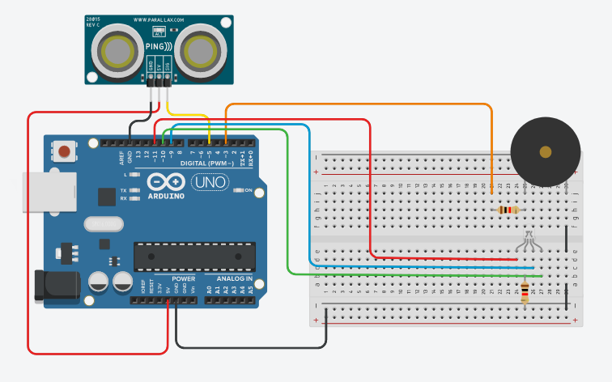
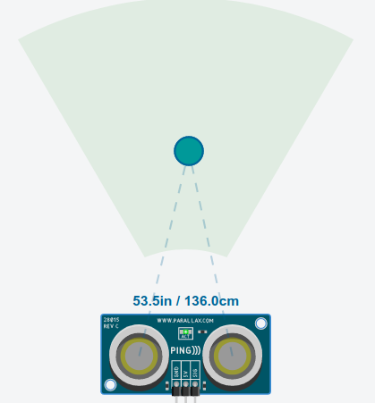
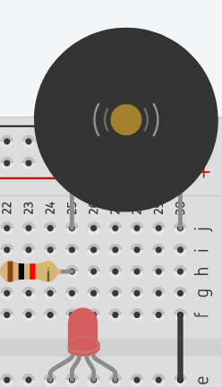

# Alarme com Arduino

### Este pequeno circuito feito em arduino, dispara caso algo ou alguém se aproxime demais do sensor.

## sensor

## Estado verde
Caso o objeto/pessoa esteja a uma distância considerável (ou que não haja nada dentro do campo de visão do sensor) o sensor permanece apenas com o led ligado no modo verde.

## Estado amarelo
Caso o objeto/pessoa comece a se aproximar, mais do que o normal, o led muda para o modo amarelo.

## Estado vermelho
Caso o objeto/pessoa chegue a uma distância muito próxima, a ponto de representar algum perigo, o led muda para o estado vermelho e é emitido um alarme (atavés de um componente buzzer).

